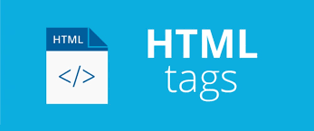

# Welcome to the HTML Map Tags

👋 Welcome to the official repository of the XYZ Plugin! We're thrilled to introduce you to our powerful and versatile software plugin, meticulously crafted by our talented team of software engineers. Whether you're a developer, designer, or an enthusiast, this plugin aims to enhance your experience by bringing a new dimension to your workflow.

## What is the HTML Map Tags?

We welcome contributions from the community!

## Key Features

- 🚀 **Feature 1:** Feature.
- 🎨 **Feature 2:** Feature.
- 📦 **Feature 3:** Feature.
- 📊 **Feature 1:** Feature.
- ⚙️ **Feature 1:** Feature.

## Getting Started

Getting started with the XYZ Plugin is a breeze:

1. **From Menu:** We welcome contributions from the community!
2. **From Menu:** We welcome contributions from the community!
3. **From Menu:** We welcome contributions from the community!

## Installation

We welcome contributions from the community!

## Documentation

We welcome contributions from the community!

## Feedback and Support

We value your input! If you have any feedback, suggestions, or run into any issues, please don't hesitate to [open an issue](../../issues) here on GitHub.

For additional assistance, you can also contact our support team at support@xyzplugin.com.

## Contributing

We welcome contributions from the community! If you're interested in improving the XYZ Plugin, please review our [Contribution Guidelines](contributing.md).

## Stay Connected

Stay up-to-date with the latest developments, updates, and announcements by following us on [Twitter](https://twitter.com/xyzplugin) and subscribing to our newsletter on our official website.

We're excited to have you on board and can't wait to see how the XYZ Plugin transforms your creative and development endeavors. Happy coding!

*— The XYZ Plugin Team*

